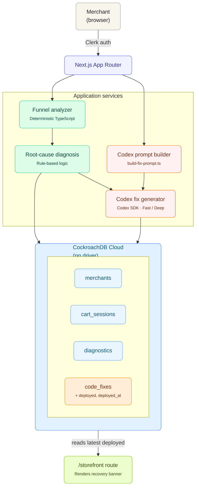

# Cart Recovery Agent

Cart Recovery Agent is an AI-powered eCommerce workflow app that helps merchants diagnose abandoned carts and generate code fixes with Codex.

The demo flow is simple:

1. A merchant logs in.
2. The merchant pastes abandoned cart session data.
3. The app stores the sessions in CockroachDB.
4. The app computes checkout funnel metrics.
5. The app identifies the likely abandonment root cause.
6. Codex generates a React + Tailwind storefront fix and a matching test.
7. The merchant previews the generated fix.
8. The merchant deploys the fix to a demo storefront.
9. The `/storefront` page changes from the old cart experience to the improved Codex-generated recovery experience.

The core idea is:

> Most analytics tools tell merchants where shoppers abandon checkout. Cart Recovery Agent goes one step further: it generates the code fix.

---

## What the app does

Cart Recovery Agent focuses on one high-value eCommerce problem: abandoned carts.

Given sample cart session data, the app analyzes the checkout funnel and identifies where shoppers are dropping off. For example, if many shoppers reach the shipping step but fail to continue to payment, and shipping costs are high, the app diagnoses the issue as `shipping_cost_shock`.

The app then uses Codex to generate a targeted storefront fix, such as a free-shipping threshold banner.

Example generated fix:

```tsx
<FreeShippingThresholdBanner
  cartTotal={62}
  freeShippingThreshold={75}
/>
```

The app persists the full workflow:

- merchant identity
- cart sessions
- diagnostic results
- Codex-generated code fixes
- generation mode metadata
- deployment status

The app also includes a demo storefront at `/storefront`. Before a fix is deployed, the storefront shows the original cart experience where shoppers discover shipping costs late in checkout. After a fix is deployed, the storefront reads the latest deployed `code_fixes` row from CockroachDB and renders the free-shipping recovery banner.

This makes the deployment visible in the product demo:

```txt
Before deploy:
  No recovery fix deployed yet.

After deploy:
  You are $13.00 away from free shipping.
  Codex-generated fix deployed from Cart Recovery Agent.
```

---

## Tech stack

- **Next.js App Router** — full-stack web app
- **TypeScript** — type-safe application code
- **Tailwind CSS** — UI styling
- **Clerk** — login and user authentication
- **CockroachDB Cloud Basic** — transactional persistence
- **pg / node-postgres** — direct database access
- **Codex SDK** — programmatic Codex integration
- **Vitest** — unit tests
- **React Testing Library** — generated test target for UI components

---

## Architecture

## Architecture



The app intentionally separates deterministic analysis from AI-generated remediation.

- TypeScript computes the funnel metrics.
- Rule-based diagnosis identifies the likely root cause.
- Codex generates the code fix and test.

This keeps the business metrics reliable while still using Codex for the software engineering task.

---

## Database schema

The app uses four main tables:

```txt
merchants
  Stores Clerk-authenticated merchants.

cart_sessions
  Stores pasted abandoned cart sessions.

diagnostics
  Stores funnel metrics and root-cause analysis.

code_fixes
  Stores Codex-generated code, tests, deployment metadata, and generation mode.
```

The schema lives in:

```txt
src/lib/schema.sql
```

---

## How to run locally

### 1. Install dependencies

```bash
npm install
```

### 2. Create `.env.local`

Create a local environment file:

```bash
cp .env.example .env.local
```

Fill in the values:

```env
NEXT_PUBLIC_CLERK_PUBLISHABLE_KEY=
CLERK_SECRET_KEY=

NEXT_PUBLIC_CLERK_SIGN_IN_URL=/sign-in
NEXT_PUBLIC_CLERK_SIGN_UP_URL=/sign-up
NEXT_PUBLIC_CLERK_AFTER_SIGN_IN_URL=/dashboard
NEXT_PUBLIC_CLERK_AFTER_SIGN_UP_URL=/dashboard

DATABASE_URL=

CODEX_MOCK=true
CODEX_FAST_MODEL=gpt-5.2-codex
CODEX_DEEP_MODEL=gpt-5.3-codex
```

### 3. Start the dev server

```bash
npm run dev
```

Open:

```txt
http://localhost:3000
```

The root route redirects to the merchant dashboard.

---

## How to initialize the database

The app uses CockroachDB Cloud Basic.

Create a CockroachDB database, for example:

```sql
CREATE DATABASE IF NOT EXISTS cartrecovery;
```

Set `DATABASE_URL` in `.env.local`:

```env
DATABASE_URL="postgresql://<user>:<password>@<host>:26257/cartrecovery?sslmode=verify-full"
```

Then initialize the schema:

```bash
npm run db:init
```

If you added the generation mode columns after the first schema initialization, run:

```bash
npm run db:migrate:mode
```

This migration adds:

```txt
generation_mode
model_name
```

to the `code_fixes` table.

---

## Demo storefront

The app includes a demo storefront route:

```txt
/storefront
```

This route shows how the generated fix affects a merchant’s customer-facing cart experience.

Before any code fix is deployed, `/storefront` shows the original cart experience:

```txt
No recovery fix deployed yet.
Shoppers currently discover shipping cost late in checkout.
```

After the merchant clicks **Deploy to Demo Store**, the app updates the selected `code_fixes` row:

```txt
deployed = true
status = deployed
deployed_at = current timestamp
```

Then `/storefront` reads the latest deployed fix and renders the recovery banner:

```txt
You are $13.00 away from free shipping.
Codex-generated fix deployed from Cart Recovery Agent.
```

This is intentionally a sandbox deployment. It does not push to a real Shopify storefront or production environment. In a production version, this boundary could create a GitHub pull request, update a CMS block, or trigger a storefront deployment pipeline.

To reset the demo storefront back to the “before deploy” state, run:

```bash
npm run db:reset-demo
```

---

## How to run tests

Run:

```bash
npm test
```

Current test coverage includes:

- cart funnel analysis
- root-cause diagnosis
- Codex prompt construction

The tests are intentionally focused on the core workflow logic.

---

## How to build

Run:

```bash
npm run build
```

This validates that the app compiles and type-checks successfully.

---

## How Codex is used

Codex is integrated behind a single boundary:

```txt
src/lib/codex/generate-fix.ts
```

The app flow is:

1. The merchant creates a diagnostic.
2. The app builds a structured Codex prompt using:
   - root cause
   - drop-off metrics
   - UI constraints
   - expected JSON output shape
3. Codex generates:
   - fix type
   - component name
   - React + Tailwind component code
   - Vitest / React Testing Library test code
   - explanation
   - deployment notes
4. The generated output is saved to CockroachDB in `code_fixes`.

The prompt builder lives in:

```txt
src/lib/codex/build-fix-prompt.ts
```

The app supports two generation modes:

```txt
Fast Fix
  Intended for smaller, lower-risk storefront changes.

Deep Fix
  Intended for more complex checkout remediation.
```

The selected mode and model name are persisted with the generated fix.

---

## Why `CODEX_MOCK` exists

The app supports:

```env
CODEX_MOCK=true
```

When mock mode is enabled, the app returns a deterministic Codex-style response instead of making a live Codex SDK call.

This exists for three reasons:

1. **Reliable demo recording**  
   The app can be demonstrated without depending on network latency, SDK auth, or model availability.

2. **Repeatable development**  
   The generated fix is stable while building the UI and database workflow.

3. **Safe fallback**  
   The production integration boundary is still present, but the app can run locally even without live Codex credentials.

The important point is that the app still contains a real server-side Codex SDK integration path. `CODEX_MOCK` simply controls whether the live path is used.

For a live SDK run, set:

```env
CODEX_MOCK=false
```

Then restart the dev server.

---

## Useful commands

```bash
npm run dev
npm test
npm run build
npm run db:init
npm run db:migrate:mode
npm run db:reset-demo
```

Use `npm run db:reset-demo` before recording the demo if you want `/storefront` to start in the “before deploy” state.

---

## Notes

This project is intentionally scoped for a short Codex-focused assignment. It does not deploy to a real production storefront. The **Deploy to Demo Store** action records deployment state in CockroachDB and updates the generated fix status. The `/storefront` route then reads that deployed state and renders the improved cart experience.
